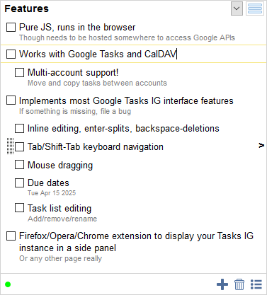

Google Tasks is a service by Google partially integrated in Calendar. It had a separate lightweight JS frontend perfect for a using in a browser sidebar, which had been shut down:

> **https://mail.google.com/tasks/ig**

This project reimplements everything in that frontend from scratch. It uses Google Tasks API to access Tasks but can support different backends (including CalDAV tasks!)

**[Try it here on GitHub](https://himselfv.github.io/tasks-ig/)** (CalDAV/local storage only)

### Features
* Runs in the browser, locally or self-hosted (for Google Tasks)
* Works with Google Tasks and CalDAV
* Multi-account support, moving and copying tasks between accounts
* Implements most Google Tasks IG interface features: inline editing, enter-splits, backspace-deletions, tab/shift-tab, keyboard navigation, move to list, task list commands, undelete. If something is missing, file an issue.
* Async requests, fast UI with neat activity indicator
* Export tasks

### Runs as a:

* Chrome extension (on a separate page)
* Firefox/Opera extension (in a sidebar)
* Self-hosted &mdash; on your own domain
* Firefox/Opera extension for a self-hosted version (in a sidebar)
* Standalone &mdash; as a local HTML file, or [here on GitHub](https://himselfv.github.io/tasks-ig/)

Different backends are available in each case:

|				| CalDAV| Google Tasks	| Browser (sync)	| Browser (local)	|
|------				|:----:	|:----:		|:----:			|:----:			|
| Chrome extension (page)	| +	| +		| +			| +			|
| Firefox extension (sidebar)	| +	| 		| +			| +			|
| Self-hosted			| +	| +		| 			| + (less safe)		|
| Self-hosted in sidebar	| +	| +		| 			| + (less safe)		|
| Local file or github		| +	| 		| 			| + (less safe)		|

Browser backends are completely offline. The sync version is synchronized by the browser between your different PCs. The "less safe" versions use Local Storage instead of Extension's Storage and it's easy to reset by cleaning cookies, so I wouldn't store anything important.

### The browser extensions

**Chrome**: [Extension page](https://chrome.google.com/webstore/detail/tasks-ig/nemjdegnmkepopaeifiolicbkgldjokn)

**Firefox**: [Addon page](https://addons.mozilla.org/ru/firefox/addon/tasks-ig/)

**Firefox Sidebar for Standalone version**: [Addon page](https://addons.mozilla.org/ru/firefox/addon/tasks-ig-webpanel/)

To load from sources here:

Chrome: Go to Extensions page and enable "Developer mode". Press "Load unpacked extension" and point it to the folder with Tasks IG.

Firefox: Go to `about:debugging`, check "Enable extension debugging" and press "Load temporary extension". Point it to the `manifest.json`.

### Self-hosting
Tasks IG can be copied and run from anywhere, including your own server or a local file.

Just double-click `index.html` or [access it on Github](https://himselfv.github.io/tasks-ig/).

You can put your self-hosted instance in a Firefox sidebar instead of a browser-hosted copy. Install the extension in the `webpanel` folder and set the URL in the options.

#### Speed up self-hosted version

* Enable etags and long caching of all js/css/resources to avoid repeated requests
* Compile Tasks IG with `make min` and host minified version: all JS merged into a single file (harder to debug).

### CalDAV

CalDAV Tasks are now supported!

* Work in all environments, including from [here on GitHub](https://himselfv.github.io/tasks-ig/)
* Subtasks via RELATED-TO, the most supported way
* Fixed ordering via X-APPLE-SORT-ORDER, the only at least somewhat supported way
* Surprisingly fast
* No calendar creation/deletion -- please use a full-blown CalDAV client for initial setup
* No task recurrence

#### Setting up your own CalDAV

If your Tasks IG instance is hosted on a different server than your CalDAV, requests to CalDAV are [cross-origin](https://developer.mozilla.org/en-US/docs/Web/HTTP/CORS). You need to configure CORS:

* Return 200 on OPTIONS, even if unauthenticated
* All requests are made with NO `withCredentials`. We'll try to stick to that as allowing `withCredentials` is a security hole.
* `Access-Control-Allow-Origin: *`
* `Access-Control-Allow-Methods: OPTIONS, GET, HEAD, POST, PUT, DELETE, CONNECT, TRACE, PATCH, PROPFIND, COPY, MOVE`
* `Access-Control-Expose-Headers: WWW-Authenticate, etag`
* `Access-Control-Allow-Headers: *`
* You also need to respond dynamically to `Access-Control-Request-Headers` and return `Access-Control-Allow-Headers:` with requested headers specifically; the browsers won't be satisfied with '*' for some headers even in non-`withCredentials` mode.
* `Access-Control-Max-Age: 600` to enable at least some caching of OPTION requests.

#### Speed up DAV

1. Disable Service Discovery and provide a direct URL in account settings => -1 request.
2. If you're using HTTPS, switch your server from Digest to Basic auth => -1 request. Digest auth unavoidably starts with a 403. Warning: For non-encrypted HTTP, Basic auth is unsafe.
3. Place Tasks on the same server as your CalDAV instance - this removes CORS entirely (up to 2x the number of requests). _Protocol_, _host_ and _port_ all need to match. If you're using HTTPS for CalDAV (as you should), use HTTPS for Tasks too.

### Google Tasks
Google only allows third-party apps to access Tasks either from a Chrome extension, or if your self-host and configure Google API keys. For Chrome, just install the extension. See "Extensions".

For self-hosting:

1. You need a domain. Google Tasks requires having an origin hostname.

2. Upload the contents (excluding docs and extension) under some URL on your server.

3. Register new ``application`` in Google API Developer Console and create ``API Key`` and ``OpenID Client`` for it. Add your domain as a trusted domain for the ``application``, and your full URL as an allowed origin for that ``OpenID Client``. You may restrict ``API Key`` too but it's not required and first try without it.

4. Rename ``config-example.js`` to ``config.js`` and insert your API key and Client ID there.

5. Access the URL and press "Authorize with Google". (The local storage version should work from step 2).

**Plan B:**

* Find someone who hosts it and use their instance (if you trust them).

### FAQ

**Q:** Can/should I use this on mobile?

**A:** You can, but there are better clients both for Google Tasks and for DAV (for example, [Tasks.org](https://f-droid.org/ru/packages/org.tasks/)). Tasks IG is mostly meant for a browser/sidebar.

**Q:** I accidentally a task, can I undelete it?

**A:** Only in Google Tasks. Check "Show deleted tasks" in Options. To restore a deleted task, simply edit it and save. Remember to disable "Show deleted tasks" later; this is a last ditch effort, not a workable mode.

### License and attribution
This project uses icons and other resources which might have their separate licenses. Please see [LICENSE.txt](LICENSE.txt) for licenses and attribution.
 
