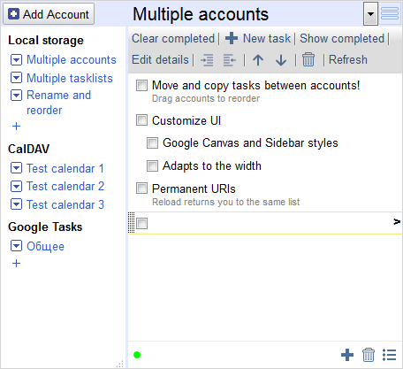

Google Tasks is a TODO/Task service by Google integrated in Calendar. It had a few lightweight JS frontends perfect for a browser sidebar which had been shut down:

> **https://mail.google.com/tasks/ig**
> **https://mail.google.com/tasks/canvas**

This project reimplements those frontends from scratch. It supports both styles, multiple accounts with [different backends](#backends) (including [Google Tasks](#backend-gtasks) and [CalDAV tasks](#backend-caldav)!)

 

**[Try it now on GitHub](https://himselfv.github.io/tasks-ig/)** (CalDAV/local storage only)

### Features
* Runs in the browser, from local file or self-hosted
* Works with [Google Tasks](#backend-gtasks), [CalDAV](#backend-caldav) and [browser-synced tasks](#backend-browser)
* Multi-account support, moving and copying tasks between accounts, exporting tasks
* Implements most Google Tasks IG interface features: inline editing, enter-splits, backspace-deletions, tab/shift-tab, keyboard navigation, move to list, task list commands, undelete.
* Async requests, fast UI with activity indicator
* [Custom UI Styles](#styles): Both Canvas and Sidebar/IG are available

### Runs as a:
* [Chrome/Firefox/Opera browser extension](#extensions)
* [Hosted on your own domain](#self-hosting) (can also be [put in a sidebar](#sidebar-standalone))
* From a local HTML file, or [here on GitHub](https://himselfv.github.io/tasks-ig/)

CalDAV is always available, Google Tasks works only on Chrome or own domain, Browser in all browser extensions:

|						| [CalDAV](#backend-caldav)| [Google Tasks](#backend-gtasks)	| [Browser (sync)](#backend-browser)	| [Browser (local)](#backend-browser)			|
|------						|:----:	|:----:		|:----:			|:----:			|
| [Chrome extension (page)](#extensions)	| +	| +		| +			| +			|
| [Firefox/Opera (sidebar)](#extensions)	| +	| 		| +			| +			|
| [Self-hosted](#self-hosting)			| +	| +		| 			| + ([less safe](#backend-local-storage))		|
| [Self-hosted in sidebar](#webpanel)		| +	| +		| 			| + ([less safe](#backend-local-storage))		|
| [Local file or github](#self-hosting)		| +	| 		| 			| + ([less safe](#backend-local-storage))		|

###  The browser extensions

**Chrome**: [Extension page](https://chrome.google.com/webstore/detail/tasks-ig/nemjdegnmkepopaeifiolicbkgldjokn)

**Firefox**/**Opera**: [Addon page](https://addons.mozilla.org/ru/firefox/addon/tasks-ig/)

**Firefox/Opera Sidebar for Standalone version**: [Addon page](https://addons.mozilla.org/ru/firefox/addon/tasks-ig-webpanel/)

> To load from sources:
>
> Chrome: Go to Extensions page and enable "Developer mode". Press "Load unpacked extension" and point it to the folder with Tasks IG.
>
> Firefox: Go to `about:debugging`, check "Enable extension debugging" and press "Load temporary extension". Point it to the `manifest.json`.

###  Self-hosting
Tasks IG can be copied and run from anywhere, including [from your own server](docs/hosting.md) or a local file. Just double-click `index.html` or [access it on Github](https://himselfv.github.io/tasks-ig/).

You can put your self-hosted instance in a [Firefox/Opera sidebar](#webpanel) instead of a separate page. Install the extension and set the URL in options.

### CalDAV
CalDAV Tasks are now supported!

* Work in all environments including [from here on GitHub](https://himselfv.github.io/tasks-ig/)
* Subtasks via RELATED-TO, the most supported way
* Fixed ordering via X-APPLE-SORT-ORDER, the only at least somewhat supported way
* Surprisingly okay speed
* No calendar creation/deletion -- please use a full-blown CalDAV client for initial setup
* No task recurrence

See [How to configure your own CalDAV server](docs/hosting.md#caldav).

### Google Tasks
Google Tasks can only be accessed either [from a Chrome extension](#extensions) or from your own domain [if you configure Google API keys](docs/hosting.md#gtasks).

If you don't have a domain you can find someone else who does who you trust (if you run Tasks from them, they can spoof it to access your tasks).

### Browser backends
Store data [locally in the browser](https://developer.mozilla.org/en-US/docs/Mozilla/Add-ons/WebExtensions/API/storage). They work even while offline. The sync version is synchronized between your different PCs in the background. In this way you can have a fully serverless but distributed tasks (but you will only be able to access them from the browser).

"Less safe" versions use [Local Storage](https://developer.mozilla.org/en-US/docs/Web/API/Window/localStorage) instead of [extension Storage](https://developer.mozilla.org/en-US/docs/Mozilla/Add-ons/WebExtensions/API/storage) and it's easy to reset by clearing cookies, so I wouldn't store anything important.

###  Custom UI styles
Add your custom CSS by listing it in index.html or in Options ("Additional style files"). By default two styles are available:

* No style: Minimalist sidebar-style UI (replicates tasks/ig in narrow mode)
* style-canvas.css: Google Canvas replica (tasks/canvas)

Both styles collapse into one column when the window is narrower than 600px.

### FAQ

**Q:** Can/should I use this on mobile?

**A:** You can, but there are better clients both for Google Tasks and for DAV (for example, [Tasks.org](https://f-droid.org/ru/packages/org.tasks/)). Tasks IG is mostly meant for a browser/sidebar.

**Q:** Can I undelete a task?

**A:** Only in Google Tasks backend. Check "Show deleted tasks" in Options. To restore a deleted task, simply edit it and save. Remember to disable "Show deleted tasks" later; this is a last ditch effort, not a workable mode.

### License and attribution
This project uses icons and other resources which might have their separate licenses. Please see [LICENSE.txt](LICENSE.txt) for licenses and attribution.
 
